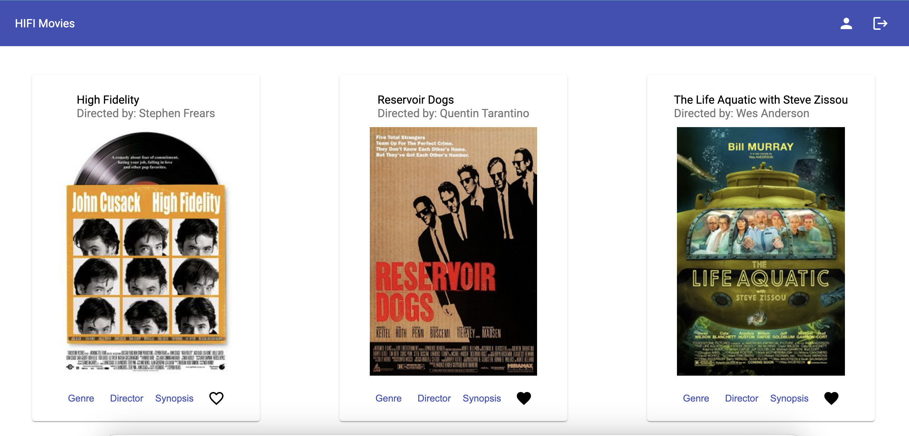

# HifiMoviesAngularClient

This project was generated with [Angular CLI](https://github.com/angular/angular-cli) version 16.1.6.

## Development server

Run `ng serve` for a dev server. Navigate to `http://localhost:4200/`. The application will automatically reload if you change any of the source files.

## Code scaffolding

Run `ng generate component component-name` to generate a new component. You can also use `ng generate directive|pipe|service|class|guard|interface|enum|module`.

## Build

Run `ng build` to build the project. The build artifacts will be stored in the `dist/` directory.

## Running unit tests

Run `ng test` to execute the unit tests via [Karma](https://karma-runner.github.io).

## Running end-to-end tests

Run `ng e2e` to execute the end-to-end tests via a platform of your choice. To use this command, you need to first add a package that implements end-to-end testing capabilities.

## Further help

To get more help on the Angular CLI use `ng help` or go check out the [Angular CLI Overview and Command Reference](https://angular.io/cli) page.

<!-- Improved compatibility of back to top link: See: https://github.com/othneildrew/Best-README-Template/pull/73 -->

<a name="readme-top"></a>

<!--
*** Thanks for checking out the Best-README-Template. If you have a suggestion
*** that would make this better, please fork the repo and create a pull request
*** or simply open an issue with the tag "enhancement".
*** Don't forget to give the project a star!
*** Thanks again! Now go create something AMAZING! :D
-->

<!-- PROJECT SHIELDS -->
<!--
*** I'm using markdown "reference style" links for readability.
*** Reference links are enclosed in brackets [ ] instead of parentheses ( ).
*** See the bottom of this document for the declaration of the reference variables
*** for contributors-url, forks-url, etc. This is an optional, concise syntax you may use.
*** https://www.markdownguide.org/basic-syntax/#reference-style-links
-->

[![Contributors][contributors-shield]][contributors-url]
[![Forks][forks-shield]][forks-url]
[![Stargazers][stars-shield]][stars-url]
[![Issues][issues-shield]][issues-url]
[![MIT License][license-shield]][license-url]
[![LinkedIn][linkedin-shield]][linkedin-url]

<!-- PROJECT LOGO -->
<br />
<div align="center">
  <a href="https://github.com/Carbon-42/hifiMovies-angular-client">
    
  </a>

<h3 align="center">A Time & Place</h3>
<a href="https://carbon-42.github.io/hifiMovies-angular-client" target="_blank">Live URL</a>

  <p align="center">
    <!-- project_description -->
    <br />
    <a href="https://github.com/Carbon-42/hifiMovies-angular-client"><strong>Explore the docs »</strong></a>
    <br />
    <br />
    <a href="https://github.com/Carbon-42/hifiMovies-angular-client">View Demo</a>
    ·
    <a href="https://github.com/Carbon-42/hifiMovies-angular-client/issues">Report Bug</a>
    ·
    <a href="https://github.com/Carbon-42/hifiMovies-angular-client/issues">Request Feature</a>
  </p>
</div>

<!-- TABLE OF CONTENTS -->
<details>
  <summary>Table of Contents</summary>
  <ol>
    <li>
      <a href="#about-the-project">About The Project</a>
    </li>
    <li><a href="#built-with">Built With</a></li>
    <li><a href="#user-stories">User Stories</a></li>
    <li><a href="#features">Features</a></li>
    <!-- <li> -->
      <!-- <a href="#getting-started">Getting Started</a> -->
      <!-- <ul> -->
        <!-- <li><a href="#prerequisites">Prerequisites</a></li> -->
        <!-- <li><a href="#installation">Installation</a></li> -->
      <!-- </ul> -->
    <!-- </li> -->
    <!-- <li><a href="#usaxge">Usage</a></li> -->
    <!-- <li><a href="#contributing">Contributing</a></li> -->
    <!-- <li><a href="#license">License</a></li> -->
    <!-- <li><a href="#contact">Contact</a></li> -->
    <!-- <li><a href="#acknowledgments">Acknowledgments</a></li> -->
  </ol>
</details>

<!-- ABOUT THE PROJECT -->

## About The Project



HIFI Movies Angular Client is a client UI integrated with the HIFI Movie API to create a full stack "movies" web application. The web application will provide users with access to information about different movies, directors, and genres. Users can sign up, update their personal information, and create a list of their favorite movies.

<!-- Here's a blank template to get started: To avoid retyping too much info. Do a search and replace with your text editor for the following: `Carbon-42`, `hifiMovies-angular-client`, ``, `brad-richardson-6`, `email_client`, `email`, `A Time & Place`, `project_description` -->

<p align="right">(<a href="#readme-top">back to top</a>)</p>

## Built With

- [![Angular][Angular.io]][Angular-url]

<p align="right">(<a href="#readme-top">back to top</a>)</p>

<!-- GETTING STARTED -->

<!-- ## Getting Started

This is an example of how you may give instructions on setting up your project locally.
To get a local copy up and running follow these simple example steps.

### Prerequisites

This is an example of how to list things you need to use the software and how to install them.

- npm
  ```sh
  npm install npm@latest -g
  ```

### Installation

1. Get a free API Key at [https://example.com](https://example.com)
2. Clone the repo
   ```sh
   git clone https://github.com/Carbon-42/hifiMovies-angular-client.git
   ```
3. Install NPM packages
   ```sh
   npm install
   ```
4. Enter your API in `config.js`
   ```js
   const API_KEY = "ENTER YOUR API";
   ```

<p align="right">(<a href="#readme-top">back to top</a>)</p> -->

<!-- USAGE EXAMPLES -->

<!-- ## Usage

Use this space to show useful examples of how a project can be used. Additional screenshots, code examples and demos work well in this space. You may also link to more resources.

_For more examples, please refer to the [Documentation](https://example.com)_

<p align="right">(<a href="#readme-top">back to top</a>)</p> -->

<!-- ## User Stories -->

## User Stories

1. As a user, I want to be able to access information about movies so that I can learn more
   about movies I’ve watched or am interested in.
   <br>
2. As a user, I want to be able to create a profile so I can save data about my favorite movies.
   <br>

<!-- ## Features -->

## Features

   <br>

#### FEATURE 1: LOGIN VIEW

> ● Allows users to log in with a username and password

<br>

#### FEATURE 2: SIGNUP VIEW

> ● Allows new users to register (username, password, email, date of birth)

<br>

#### FEATURE 3: MAIN VIEW

> ● Returns ALL movies to the user (each movie item with an image, title, and description)  
> ● Ability to open a dialog for movie synopsis  
> ● Ability to open a dialog for director details  
> ● Ability to open a dialog for genre details  
> ● Ability to log out  
> ● Ability to navigate to Profile view  
> ● Allows users to add a movie to their list of favorites

<br>

#### FEATURE 4: PROFILE VIEW

> ● Displays user registration details  
> ● Allows users to update their info (username, password, email, date of birth)  
> ● Displays favorite movies  
> ● Allows existing users to deregister

---

See the [open issues](https://github.com/Carbon-42/hifiMovies-angular-client/issues) for a full list of proposed features (and known issues).

<p align="right">(<a href="#readme-top">back to top</a>)</p>

<!-- CONTRIBUTING -->

<!-- ## Contributing

Contributions are what make the open source community such an amazing place to learn, inspire, and create. Any contributions you make are **greatly appreciated**.

If you have a suggestion that would make this better, please fork the repo and create a pull request. You can also simply open an issue with the tag "enhancement".
Don't forget to give the project a star! Thanks again!

1. Fork the Project
2. Create your Feature Branch (`git checkout -b feature/AmazingFeature`)
3. Commit your Changes (`git commit -m 'Add some AmazingFeature'`)
4. Push to the Branch (`git push origin feature/AmazingFeature`)
5. Open a Pull Request -->

<!-- <p align="right">(<a href="#readme-top">back to top</a>)</p> -->

<!-- LICENSE -->

<!-- ## License

Distributed under the MIT License. See `LICENSE.txt` for more information.

<p align="right">(<a href="#readme-top">back to top</a>)</p> -->

<!-- CONTACT -->

<!-- ## Contact -->

<!-- Your Name - [@](https://twitter.com/) - email@email_client.com

Project Link: [https://github.com/Carbon-42/hifiMovies-angular-client](https://github.com/Carbon-42/hifiMovies-angular-client)

<p align="right">(<a href="#readme-top">back to top</a>)</p> -->

<!-- ACKNOWLEDGMENTS -->

<!-- ## Acknowledgments

- []()
- []()
- []() -->

<!-- <p align="right">(<a href="#readme-top">back to top</a>)</p> -->

<!-- MARKDOWN LINKS & IMAGES -->
<!-- https://www.markdownguide.org/basic-syntax/#reference-style-links -->

[contributors-shield]: https://img.shields.io/github/contributors/Carbon-42/hifiMovies-angular-client.svg?style=for-the-badge
[contributors-url]: https://github.com/Carbon-42/hifiMovies-angular-client/graphs/contributors
[forks-shield]: https://img.shields.io/github/forks/Carbon-42/hifiMovies-angular-client.svg?style=for-the-badge
[forks-url]: https://github.com/Carbon-42/hifiMovies-angular-client/network/members
[stars-shield]: https://img.shields.io/github/stars/Carbon-42/hifiMovies-angular-client.svg?style=for-the-badge
[stars-url]: https://github.com/Carbon-42/hifiMovies-angular-client/stargazers
[issues-shield]: https://img.shields.io/github/issues/Carbon-42/hifiMovies-angular-client.svg?style=for-the-badge
[issues-url]: https://github.com/Carbon-42/hifiMovies-angular-client/issues
[license-shield]: https://img.shields.io/github/license/Carbon-42/hifiMovies-angular-client.svg?style=for-the-badge
[license-url]: https://github.com/Carbon-42/hifiMovies-angular-client/blob/master/LICENSE.txt
[linkedin-shield]: https://img.shields.io/badge/-LinkedIn-black.svg?style=for-the-badge&logo=linkedin&colorB=555
[linkedin-url]: https://linkedin.com/in/brad-richardson-6
[product-screenshot]: images/screenshot.png
[Next.js]: https://img.shields.io/badge/next.js-000000?style=for-the-badge&logo=nextdotjs&logoColor=white
[Next-url]: https://nextjs.org/
[React.js]: https://img.shields.io/badge/React-20232A?style=for-the-badge&logo=react&logoColor=61DAFB
[React-url]: https://reactjs.org/
[Vue.js]: https://img.shields.io/badge/Vue.js-35495E?style=for-the-badge&logo=vuedotjs&logoColor=4FC08D
[Vue-url]: https://vuejs.org/
[Angular.io]: https://img.shields.io/badge/Angular-DD0031?style=for-the-badge&logo=angular&logoColor=white
[Angular-url]: https://angular.io/
[Svelte.dev]: https://img.shields.io/badge/Svelte-4A4A55?style=for-the-badge&logo=svelte&logoColor=FF3E00
[Svelte-url]: https://svelte.dev/
[Laravel.com]: https://img.shields.io/badge/Laravel-FF2D20?style=for-the-badge&logo=laravel&logoColor=white
[Laravel-url]: https://laravel.com
[Bootstrap.com]: https://img.shields.io/badge/Bootstrap-563D7C?style=for-the-badge&logo=bootstrap&logoColor=white
[Bootstrap-url]: https://getbootstrap.com
[JQuery.com]: https://img.shields.io/badge/jQuery-0769AD?style=for-the-badge&logo=jquery&logoColor=white
[JQuery-url]: https://jquery.com
